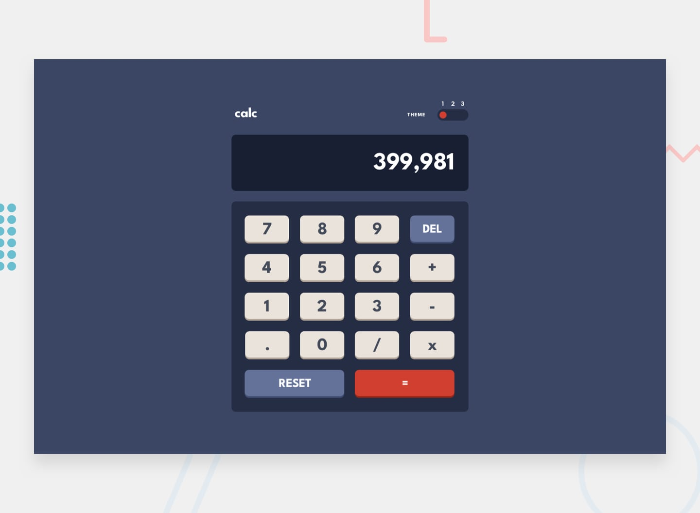

# Calculator App – Frontend Mentor Challenge

## 🚧 Status: In Progress

This is a solution to the [Frontend Mentor Calculator App Challenge](https://www.frontendmentor.io/challenges/calculator-app-9lteq5N29). So far, I’ve implemented the UI using **HTML & CSS**, closely following the provided design.

> 💡 Next Step: I'll be adding JavaScript functionality for arithmetic operations and building in theme-switching support.

---

## 🌟 Built With

- Semantic HTML5
- CSS Grid & Flexbox
- Mobile-first responsive design
- [Frontend Mentor Starter Files](https://www.frontendmentor.io)

---

## 📸 Screenshot

*(Insert screenshot here once you're ready, e.g. after JS is added or polish phase is complete)*

---

## 🎯 What I Learned

So far, this project helped reinforce:

- **CSS Grid layout areas**
- UI alignment and spacing
- Better responsiveness across screen sizes
- Styling consistency from design references

---

## 📬 Feedback

Feel free to share feedback, especially around accessibility, layout practices, or any suggestions for improvement.

---

## 📌 Live Preview

Coming soon...

---

## 🤝 Credits

Challenge by [Frontend Mentor](https://www.frontendmentor.io).  
Coded by [@Keren (Raven's Factory)](#).

---

